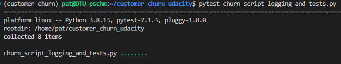

# Predict Customer Churn

This repository contains the code need to run the project **Predict Customer Churn** of the Udacity ML DevOps Engineer Nanodegree.

## Project Description
The purpose of this project is to predict whether customers are, based on features like age, gender, income and such, likely to churn from their current credit card provider, meaning that they stop using the card services. The project is also demonstrating clean code principles according to PEP8 standards. In addition to that, tests are implemented to verify the validity of the solution.

## Prerequisites
Install the necessary dependencies by running the following command:
```bash
pip install -r requirements.txt
```

## Files and data description
This project is structured as follows:
```
customer_churn_udacity
|
|__images/
|  |__eda/
|  |  |__age.png
|  |  |__correlation.png
|  |  |__gender.png
|  |
|  |__results/
|     |__classification_report.png
|     |__roc_curve.png
|
|__logs/
|  |__churn_library.log
|
|__models/
|  |__logistic_model.pkl
|  |__rfc_model.pkl
|
|__churn_library.py
|__churn_script_logging_and_tests.py
|__constants.py
|__README.md
|__requirements.txt
~
```
The `churn_library.py` file contains the logic of the project - training methods, plots and such. In addition, there is a `constants.py` file containing constant values like paths or a list of column names that denote categorical columns.

The `churn_script_logging_and_tests.py` file either runs the script if run with `ipython/python` or tests the functions implemented in `churn_library.py` if run with `pytest`.

The `images` folder contains all plots from
- The exploratory data analysis in the subfolder `eda`
- The model evaluation in the subfolder `results`

The `logs` folder contains log files from each run of the script. 

The `models` folder contains the pickled and trained models that can be dumped and loaded with `joblib`:
- Random Forest Classifier under `rfc_model.pkl`
- Logistic Regression Classifier under `logistic_model.pkl`

At the root of the folder there are other files like this README and the `requirements.txt` file that can be used to install the dependencies needed to run the scripts in this project.
## Running Files
### Naked run
To run the script without testing, execute the following at the root level of this repository:
```bash
python churn_script_logging_and_testing.py
#Alternatively:
ipython churn_script_logging_and_testing.py
```
The script will then load the data from the `data` folder, perform an explanatory data analysis which in turn will output an overview of the data on the console and create three plots in the `images/eda` folder. After that, some features are engineered in preparation for the training phase. The training phase will take some minutes, so grab a cup of coffee!

After training has completed, the two models will be dumped and will be visible in the `models` folder. These are then used to evaluate the models, which in turn creates two plots in the `images/results` folder.

In general you should be able to see what's happening in the console, in addition to that a log file containing more or less the same entries is available in the `logs` folder.

### Testing
To run the script in testing mode, run the following command at the root level of this repository:
```bash
pytest churn_script_logging_and_testing.py
```
This command executes the implemented unit tests in the specified script. It should execute without any error:



